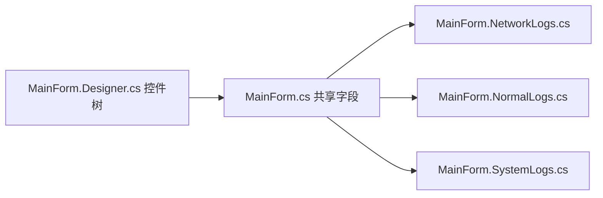
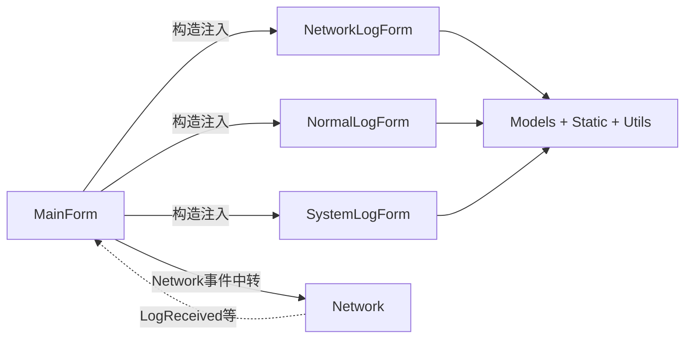
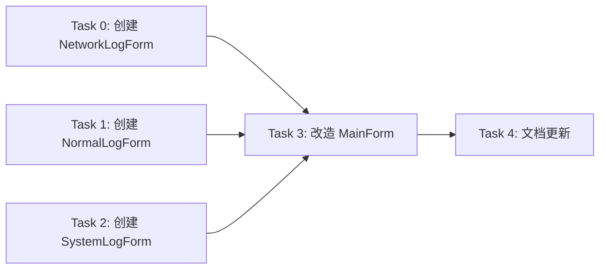

# plan-TabFormExtraction-v1-exec

> **For agentic workers:** 实施本 Plan 前先加载 `rtk` 和 `dotnet-winforms-guidelines`；按 Task 顺序执行，每完成一个 Task 运行 `rtk dotnet build` 验证。

**Goal:** 将 MainForm 的三个 Tab（网络日志、普通日志、系统日志）封装为三个独立的 Form，支持 Rider/VS 设计器独立打开并调整 UI。

**Architecture:** 每个日志类型抽取为独立 Form（`NetworkLogForm`/`NormalLogForm`/`SystemLogForm`），各自拥有 Designer.cs 控件树；MainForm 通过构造函数注入共享数据（RingBuffer/Settings/DeviceId），Tab 切换时内嵌宿主显示对应 Form。Form 依赖方向为 `Form → Models + Static + Utils`，不直接引用 Network 层——Network 层事件（LogReceived/NormalLogReceived/SystemLogReceived）由 MainForm 订阅并 BeginInvoke 到 UI 线程，数据写入 RingBuffer 也在 MainForm 中完成，Form 只接收已处理的数据。

**定位：** 改造现有功能，对 Models/Network/Utils/Static 层零影响，仅重构 UI 层内部结构。

---

## 占位符说明

| 占位符 | 含义 | 示例 |
|--------|------|------|
| `NetworkLogForm` | 网络日志窗体 | `NetworkLogForm.cs` |
| `NormalLogForm` | 普通日志窗体 | `NormalLogForm.cs` |
| `SystemLogForm` | 系统日志窗体 | `SystemLogForm.cs` |

---

## 技术栈

| 类别 | 技术选型 | 说明 |
|------|---------|------|
| **Windows UI** | WinForms + Form 内嵌 | `Form.TopLevel=false` + `FormBorderStyle=None` 宿主嵌入 TabPage |
| **验证** | `rtk dotnet build` | 每个 Task 结束后执行 |

---

## 相关 Skills

| Skill | 用途 | 加载时机 |
|-------|------|---------|
| `rtk` | 命令前缀 | 开始实施前（必需） |
| `dotnet-winforms-guidelines` | WinForms 窗体生命周期、Designer 安全 | 开始实施前（必需） |

---

## 一、功能介绍

### 1.1 背景

当前三个日志 Tab 的所有控件（ListView/FilterPanel/Button/Label）都定义在 `MainForm.Designer.cs` 中，逻辑散布在 `MainForm.NetworkLogs.cs`/`MainForm.NormalLogs.cs`/`MainForm.SystemLogs.cs` 三个 partial class 中。这导致：

1. **Designer 臃肿** — MainForm.Designer.cs 近 900 行，三种日志控件混在一起，设计器加载慢且难以定位
2. **无法独立设计** — 想调整某个 Tab 的 UI 布局，必须打开整个 MainForm
3. **职责不清** — 每个 Tab 的过滤/显示/交互逻辑与 MainForm 的设备管理/服务器事件逻辑耦合

**跨 partial class 依赖（搬迁时必须拆分）：**
- `MainForm.NetworkLogs.cs` 的 `OnExportJson()` / `OnExportTxt()` 直接调用了 `GetCurrentNormalLogBuffer()`（定义在 `MainForm.NormalLogs.cs`），还访问 `_showingNormalLog`（定义在 `MainForm.cs`）。NetworkLogs 的导出逻辑"越界"操作了 Normal 日志数据，搬迁时必须拆分。
- `MainForm.cs` 的 `UpdateLogCount()` 跨 3 个 Tab 操作，访问 `_filteredNetworkIndices`（NetworkLogs）、`_filteredNormalIndices`（NormalLogs）、`_lstNetworkLogs/_lstNormalLogs/_lstSystemLogs` 的 AutoScroll+IsAtBottom 状态。搬迁后这些私有字段/控件不再对 MainForm 可见，Form 暴露 `IsAutoScrollActive` 属性或 `ScrollStateChanged` 事件，`LogCountChanged` 事件携带计数信息。

### 1.2 现有架构



### 1.3 新增后架构



> Form 不直接引用 Network 层。Network 事件由 MainForm 订阅，数据写入 RingBuffer 后通过 Form 公共方法通知 UI 更新。

### 1.4 方案核心

每个日志 Tab 抽取为独立 Form，各自拥有 `*.Designer.cs`。MainForm 在构造时创建三个 Form 实例并嵌入 TabPage。Form 通过构造函数接收共享数据引用（RingBuffer/Settings/设备ID 等），不反向引用 MainForm。

**关键设计决策：Form vs UserControl**

| 方案 | 优点 | 缺点 |
|------|------|------|
| **Form（采纳）** | 可独立 Show() 调试；Designer 支持完整 | 内嵌需 `TopLevel=false` hack |
| UserControl | 内嵌更自然；标准 WinForms 组合模式 | 不符合"封装成 Form"要求 |

**内嵌方式：** `form.TopLevel = false; form.FormBorderStyle = FormBorderStyle.None; form.Dock = DockStyle.Fill; tabPage.Controls.Add(form); form.Show();`

**TopLevel=false 内嵌已知坑及应对：**
1. **焦点链断裂** — 内嵌 Form 中的控件不参与父 Form 的 `ProcessTabKey`，Tab 键无法从 MainForm 跳入内嵌 Form 的控件。需在 MainForm 重写 `ProcessTabKey` 或用 `SelectNextControl` 手动桥接。
2. **快捷键/菜单合并** — 内嵌 Form 的 MenuStrip/ContextMenuStrip 不与父 Form 合并。当前右键菜单在各 Form 内创建，非模态子窗口 ContextMenuStrip 有 `ToolStripManager.ModalMenuFilter` 拦截问题，内嵌 Form 可能加剧此问题。
3. **AutoSize/Docking 异常** — `Form.Dock=Fill` 在 TabPage 中偶尔不随 TabPage 尺寸变化而 relayout，需测试窗口 resize + split 移动场景。

### 1.5 功能对比

| 维度 | 现在 | 改造后 |
|------|------|--------|
| 设计器 | 只能打开 MainForm 整体 | 每个 Form 可独立打开 |
| 控件归属 | 全部在 MainForm.Designer.cs | 各 Form 自有 Designer.cs |
| 代码归属 | partial class 共享全部字段 | Form 自有字段 + 构造注入共享数据 |
| 运行时行为 | — | **有变更**：`ProcessCmdKey` 当前统一处理 End 键直接操作各 ListView 和 AutoScroll 标志，搬迁后 End 键改为委托给当前活动 Form（如 `activeForm.HandleEndKey()`） |

---

## 二、UI 设计

### 2.1 控件搬迁映射

| 现有控件（MainForm.Designer.cs） | 目标 Form | 说明 |
|------|------|------|
| `_lstNetworkLogs` + `_networkActionBar` + `_networkFilterPanel` + `_btnScrollToTop/Bottom` + `_lblLogCount` + `_networkTabContainer` (Panel) | `NetworkLogForm` | 网络 Tab 全部控件（含根容器） |
| `_lstNormalLogs` + `_normalActionBar` + `_normalFilterPanel` + `_btnNormalScrollToTop/Bottom` + `_lblNormalLogCount` + `_normalTabContainer` (Panel) | `NormalLogForm` | 普通 Tab 全部控件（含根容器） |
| `_lstSystemLogs` + `_systemActionBar` + `_systemFilterPanel` + `_btnSystemScrollToTop/Bottom` + `_btnSystemPauseResume` + `_lblSystemBacklog` + `_systemTabContainer` (Panel) | `SystemLogForm` | 系统 Tab 全部控件（含根容器） |
| `_tabLogType` + 三个 TabPage 容器 | MainForm（保留） | Tab 切换逻辑留在 MainForm，原 TabPage 从"容器+控件"变为只挂一个内嵌 Form |
| 详情面板 / 工具栏 / 状态栏 / 设备面板 | MainForm（保留） | 非本次迁移范围 |

**控件容器说明：** 当前 Designer.cs 中每个 TabPage 的直接子控件是根容器 Panel（`_networkTabContainer`/`_normalTabContainer`/`_systemTabContainer`），ListView/ActionBar/FilterPanel 都嵌在容器内部。搬迁时这些容器必须移入各 Form，否则 Form 内部布局无法在 Designer 中独立调整。原 TabPage 将从"容器+控件"变为只挂一个内嵌 Form。

**FilterPanel 自定义控件风险：** FilterPanel 是项目自定义控件（`LogViewer.UI.FilterPanel`），Rider 外部设计器对自定义控件的实例化有已知限制。需验证 FilterPanel 在独立 Form 的 Designer.cs 中能否被 Rider 正确实例化，否则设计器打开会报错。

---

## 三、数据模型设计

### 3.1 构造注入参数

**NetworkLogForm 注入参数：**

| 参数 | 类型 | 来源 |
|------|------|------|
| `deviceLogs` | `Dictionary<string, RingBuffer<LogEntry>>` | MainForm._deviceLogs |
| `allLogs` | `RingBuffer<LogEntry>` | MainForm._allLogs |
| `settings` | `AppSettings` | MainForm._settings |
| `getCurrentDeviceId` | `Func<string?>` | MainForm._currentDeviceId 动态读取 |

**NormalLogForm 注入参数：** 同上，换为 Normal 版本（`_deviceNormalLogs`, `_allNormalLogs`, `_settings`, `_getCurrentDeviceId`）。

> NormalLogForm 还需注入 `GetCurrentNormalLogBuffer()` 的依赖数据（`_currentDeviceId` + `_allNormalLogs` + `_deviceNormalLogs`）。NetworkLogForm 也需要类似的 `GetCurrentLogBuffer()` 逻辑（定义在 `MainForm.cs:554`，依赖 `_currentDeviceId` + `_allLogs` + `_deviceLogs`），两者模式一致，需统一为公共方法模式。

**SystemLogForm 注入参数：**

| 参数 | 类型 | 来源 |
|------|------|------|
| `systemLogStore` | `SystemLogSessionStore` | MainForm._systemLogStore |
| `settings` | `AppSettings` | MainForm._settings |
| `getCurrentDeviceId` | `Func<string?>` | MainForm._currentDeviceId 动态读取 |
| `adbSerialToDeviceId` | `Dictionary<string, string>` | MainForm._adbSerialToDeviceId |
| `isShowingSystemLog` | `Func<bool>` | MainForm._showingSystemLog 动态读取 |

### 3.2 事件通信

Form 向 MainForm 的事件通知：

| 事件 | 所属 Form | 说明 |
|------|----------|------|
| `LogEntrySelected` | NetworkLogForm | 选中日志条目，MainForm 更新预览面板 |
| `LogEntryDoubleClicked` | NetworkLogForm | 双击，MainForm 打开 JsonDetailForm |
| `NormalLogEntryDoubleClicked` | NormalLogForm | 普通日志双击，MainForm 打开详情窗口 |
| `LogCountChanged` | 三个 Form | 过滤/总数变化，MainForm 更新状态栏 |
| `SystemLogPausedChanged` | SystemLogForm | Pause/Resume 状态变化 |
| `ExportRequested` | NetworkLogForm + NormalLogForm | 导出请求（JSON/TXT），MainForm 协调实际导出 |
| `ClearRequested` | 三个 Form | 清空请求，MainForm 协调三方数据清除 |
| `ScrollStateChanged` | 三个 Form | AutoScroll 状态变化，MainForm 更新按钮背景色 |

**OnClear() 跨三层协调流程：**

1. MainForm 先清 RingBuffer/Store 数据
2. 再通知三个 Form 调各自的 `ClearFilterAndRefresh()`
3. 最后 `_selectedLogEntry = null` → `ShowLogDetail(null)` → `RefreshMirrorPanelState()`

关键：数据清除（RingBuffer.Clear）在 MainForm，过滤索引清除（_filteredXxxIndices.Clear）在各 Form 内部，两者必须按序执行。

**事件设计说明：**
1. **导出事件** — `OnExportJson`/`OnExportTxt` 当前同时处理网络日志和普通日志导出（通过 `_showingNormalLog` 分支）。搬迁后导出逻辑必须在 MainForm，各 Form 通过 `ExportRequested` 事件通知。
2. **清空事件** — 按钮在 MainForm 底部栏，清空需协调 3 个 Form 的数据。各 Form 通过 `ClearRequested` 事件或 MainForm 直接调用 Form 的公共 `Clear()` 方法。
3. **AutoScroll 状态** — 各 Form 暴露 `IsAutoScrollActive` 属性或 `ScrollStateChanged` 事件，MainForm 收到后调自己的 `UpdateLogCount()`。

---

## 四、实施阶段

### 依赖关系



**推荐顺序：** Task 0/1/2 可并行 → Task 3（依赖全部三个 Form 完成）→ Task 4

---

### Task 0：创建 NetworkLogForm

**Files:**
- Create: `UI/NetworkLogForm.cs`
- Create: `UI/NetworkLogForm.Designer.cs`

**验收检查点：**

| # | 检查项 | 验证方式 |
|---|--------|---------|
| 1 | 设计器可打开 NetworkLogForm | Rider 双击打开 |
| 2 | 构建通过 | `rtk dotnet build` |

- [ ] **Step 1: 创建 NetworkLogForm.cs 手写逻辑**

从 `MainForm.NetworkLogs.cs` 搬运以下方法：
- `ConfigureLogLists()` → 改为构造函数中调用
- `GetNetworkLogEntryByViewIndex()`, `OnNetworkLogsRetrieveVirtualItem()`, `CreateNetworkLogItem()`
- `GetCurrentLogBuffer()`（定义在 `MainForm.cs:554`，被 `GetNetworkLogEntryByViewIndex()` 和 `RefreshNetworkFilter()` 调用，必须随 NetworkLogForm 迁移）
- `RefreshNetworkLogList()`, `RefreshNetworkFilter()`, `MatchesNetworkFilter()`
- `TryAppendNetworkLogIncrementally()`, `ScheduleNetworkRefresh()`
- `OnNetworkLogMouseUp()`, `OnNetworkLogsMouseWheel()`, `OnNetworkLogSelected()`, `OnNetworkLogDoubleClick()`
- `CreateNetworkLogMenu()`, `ShowNetworkLogMenu()`, `FormatUrlWithBody()`
- `GetSelectedNetworkEntry()`
- `RefreshNetworkVisibleRows()`, `OnNetworkFilterChanged()`

**OnNetworkLogsMouseWheel() 跨层更新：** Form 内部设 `_networkAutoScrollEnabled = false` 后触发 `ScrollStateChanged` 事件，MainForm 收到后调自己的 `UpdateLogCount()`。NormalLogForm/SystemLogForm 同理。

**JsonDetailForm owner 问题：** `OnNetworkLogDoubleClick()` 和 `CreateNetworkLogMenu()` 中的"查看详情"都调用 `new JsonDetailForm(entry, _lstNetworkLogs.Font).Show(this)`。搬迁后 `this` 变成了 NetworkLogForm（TopLevel=false），Z-order 和 ModalMenuFilter 行为可能异常。**解决：** `LogEntryDoubleClicked` 事件触发后由 MainForm 负责创建和 Show JsonDetailForm。

**ShowLogDetail() 留在 MainForm：** `ShowLogDetail()` 操作的全是 MainForm 预览面板控件（`_jsonHeadersView`/`_jsonRequestBodyView`/`_jsonResponseBodyView` 等），不属于 NetworkLogForm。NetworkLogForm 只负责触发 `LogEntrySelected` 事件，MainForm 接收事件后调用自己保留的 `ShowLogDetail()`。`ShowLogDetail()` 后续移入 `MainForm.Preview.cs`。

**不可整体迁移的方法（需拆分）：**
- `OnExportJson()` / `OnExportTxt()` — 当前通过 `_showingNormalLog` 分支同时处理普通日志导出，调用 `GetCurrentNormalLogBuffer()`（定义在 NormalLogs.cs）。搬迁时 Normal 日志导出分支拆回 NormalLogForm 或 MainForm，NetworkLogForm 只处理网络日志导出。

**私有字段迁移：**
- `_networkRefreshScheduled`, `_networkRefreshNeedsFullFilter`, `_filteredNetworkIndices`, `_networkAutoScrollEnabled`

**`_selectedLogEntry` 不迁移：** 属于 MainForm 预览面板的状态，NetworkLogForm 的 `LogEntrySelected` 事件把 entry 传回 MainForm，由 MainForm 维护 `_selectedLogEntry` 并调用 `ShowLogDetail()`。

**共享数据通过构造函数注入（引用传递，非拷贝）：**
- `_deviceLogs`, `_allLogs`, `_settings`
- `_getCurrentDeviceId` (Func<string?>) — 动态读取当前设备

**新增事件：**
- `event Action<LogEntry?>? LogEntrySelected`
- `event Action<LogEntry?>? LogEntryDoubleClicked`

- [ ] **Step 2: 创建 NetworkLogForm.Designer.cs**

从 `MainForm.Designer.cs` 搬运以下控件声明和初始化：
- `_networkTabContainer` (Panel) — 根布局容器
- `_lstNetworkLogs` (ListView)
- `_networkFilterPanel` (FilterPanel)
- `_btnScrollToTop`, `_btnScrollToBottom` (Button)
- `_lblLogCount` (Label)
- `_networkActionBar` (Panel)

布局保持与原 MainForm 中 `_networkTabContainer` 内部布局一致。

- [ ] **Step 3: 运行构建验证**

```bash
rtk dotnet build .\LogViewer\LogViewer.csproj
```

Expected: Build succeeds（此时尚未接入 MainForm，仅验证 Form 本身编译）

**最小运行时验证：** Task 0 完成后在 MainForm 中临时嵌入空的 NetworkLogForm 到一个 TabPage，确认 Form.TopLevel=false 内嵌 + Rider 设计器打开都正常，再继续 Task 1/2。

---

### Task 1：创建 NormalLogForm

**Files:**
- Create: `UI/NormalLogForm.cs`
- Create: `UI/NormalLogForm.Designer.cs`

**验收检查点：**

| # | 检查项 | 验证方式 |
|---|--------|---------|
| 1 | 设计器可打开 NormalLogForm | Rider 双击打开 |
| 2 | 构建通过 | `rtk dotnet build` |

- [ ] **Step 1: 创建 NormalLogForm.cs 手写逻辑**

从 `MainForm.NormalLogs.cs` 搬运以下方法：
- `ConfigureNormalLogList()`, `GetCurrentNormalLogBuffer()`
- `GetNormalLogEntryByViewIndex()`, `OnNormalLogsRetrieveVirtualItem()`, `CreateNormalLogItem()`
- `LevelToDisplayText()`, `LevelFromDisplayText()`, `ExtractLocation()`, `TruncateNormalPreview()`, `LevelToColor()`
- `OnNormalLogsDoubleClick()`, `GetSelectedNormalEntry()`, `CreateNormalLogMenu()`
- `RefreshNormalLogList()`, `RefreshNormalFilter()`, `MatchesNormalFilter()`
- `TryAppendNormalLogIncrementally()`, `ScheduleNormalRefresh()`
- `OnNormalFilterChanged()`, `OnNormalLogsMouseWheel()`
- `RefreshNormalVisibleRows()`

**OnNormalLogsDoubleClick() owner 问题：** 用 `form.Show(this)` 打开详情窗口，搬迁后 `this` 变成 NormalLogForm（TopLevel=false），`Show(this)` 的 owner 语义异常。需通过事件 `NormalLogEntryDoubleClicked` 由 MainForm 打开详情窗口。

**GetApproxVisibleRowCount() 共享方法：** static 方法，被三个 Tab 的 `RefreshXxxVisibleRows()` 分别调用。提取到 `BufferedListViewHelper`（见文件清单），三个 Form 都引用此共享方法。同时 `ScrollToBottom`/`IsAtBottom`/`ScrollToTop` 三个辅助方法也一并提取到 `BufferedListViewHelper`。

**跨 Form 数据访问问题：** `GetCurrentNormalLogBuffer()` 被 NetworkLogs.cs 的导出方法跨文件调用。搬迁时此方法移入 NormalLogForm，NetworkLogForm 的导出需访问 NormalLogBuffer——NormalLogForm 暴露公共 `GetCurrentBuffer()` 方法，或导出逻辑上提至 MainForm。

**私有字段迁移：**
- `_normalRefreshScheduled`, `_normalRefreshNeedsFullFilter`, `_filteredNormalIndices`, `_normalAutoScrollEnabled`

**共享数据注入：** `_deviceNormalLogs`, `_allNormalLogs`, `_settings`, `_getCurrentDeviceId`

- [ ] **Step 2: 创建 NormalLogForm.Designer.cs**

搬运控件：`_normalTabContainer` (Panel根容器), `_lstNormalLogs`, `_normalFilterPanel`, `_btnNormalScrollToTop`, `_btnNormalScrollToBottom`, `_lblNormalLogCount`, `_normalActionBar`

- [ ] **Step 3: 构建验证**

```bash
rtk dotnet build .\LogViewer\LogViewer.csproj
```

---

### Task 2：创建 SystemLogForm

**Files:**
- Create: `UI/SystemLogForm.cs`
- Create: `UI/SystemLogForm.Designer.cs`

**验收检查点：**

| # | 检查项 | 验证方式 |
|---|--------|---------|
| 1 | 设计器可打开 SystemLogForm | Rider 双击打开 |
| 2 | 构建通过 | `rtk dotnet build` |

- [ ] **Step 1: 创建 SystemLogForm.cs 手写逻辑**

从 `MainForm.SystemLogs.cs` 搬运全部方法（约 40 个）和字段（约 15 个），这是最复杂的 Form。

**关键方法组：**
- 快照管理：`RequestSystemSnapshotRefresh()`, `BuildSystemLogSnapshotAsync()`, `TryCatchUpCurrentSnapshot()`, `ApplySystemSnapshot()`
- 数据写入：`OnSystemLogReceived()`（入队+防抖调度留 MainForm），`FlushPendingSystemLogsAsync()`（批量 UI 处理委托给 Form 的 `ProcessPendingLogs`）
- UI 刷新：`ScheduleSystemUiRefresh()`, `RefreshSystemVisibleRows()`, `RequestSystemVisibleRefresh()`
- 过滤：`OnSystemFilterChanged()`, `MatchesSystemRecord()`, `MatchesIncomingSystemEntry()`, `CaptureSystemLogQuery()`
- 暂停/恢复：`OnSystemPauseResumeClick()`, `UpdateSystemLogUiState()`
- 右键菜单：`CreateSystemLogMenu()`, `CopySelectedSystemLogAsync()`, `ShowSystemLogMenu()`
- 预取：`ScheduleSystemLogPrefetch()`, `ScheduleVisibleSystemPrefetch()`, `WarmSystemEntryAsync()`
- 标签更新：`RefreshSystemTagOptions()`, `UpdateSystemTagOptionsFromSnapshot()`

**IsSystemLogRuntimeReady() 拆分：** 被 SystemLogs.cs 内部 7 处调用，也被 `MainForm.cs` 的 4 处调用（TryMatchAdbSerial/OnDeleteDevice/OnClear/OnSettingsClick）。搬迁后 MainForm 保留 `_systemLogStore != null` 简单判断，SystemLogForm 内部自己维护更详细的就绪检查。

**私有字段迁移：** `_systemLogStore`, `_systemLogSnapshot`, `_systemSnapshotCts`, `_systemPrefetchCts`, `_systemSnapshotVersion`, `_systemLogPaused`, `_systemFreezeSequenceId`, `_systemPausedBacklog`, `_systemVisibleRefreshPending`, `_systemContextSequenceId`, `_systemUiRefreshScheduled`, `_systemUiRefreshNeedsSnapshot`, `_systemAutoScrollEnabled`, `_pendingSystemLogs`, `_pendingSystemLogsLock`, `_systemLogFlushScheduled`

**线程安全队列设计决策：** `_pendingSystemLogs` + `_pendingSystemLogsLock` + `_systemLogFlushScheduled` 是线程安全队列相关字段。入队逻辑留在 MainForm（LogcatReader 事件在 MainForm 订阅），SystemLogForm 只暴露 `ProcessPendingLogs(List<SystemLogEntry>)` 供 MainForm 调用。原因：Form 的 `BeginInvoke` 依赖 `Handle` 已创建，MainForm 构造时 SystemLogForm 可能还未 Show()，Handle 未创建，`BeginInvoke` 会失败。

**SystemLog 数据流（后台线程 → UI）：**

1. LogcatReader.SystemLogReceived（后台线程）→ MainForm.OnSystemLogReceived（后台线程回调）
2. lock `_pendingSystemLogsLock` → `_pendingSystemLogs.Enqueue(entry)` → 首次入队触发 ScheduleFlush（Task.Run + Task.Delay 80ms）
3. BeginInvoke → `FlushPendingSystemLogsAsync`（UI 线程）→ lock 取出全部 pending
4. 调 `_systemLogForm.ProcessPendingLogs` 传 `List<SystemLogEntry>`
5. SystemLogForm 内部：`_systemLogStore.AddRange` + 累计 `_systemPausedBacklog` + `ScheduleSystemUiRefresh`

**共享数据注入：** `_systemLogStore`, `_settings`, `_getCurrentDeviceId`, `_adbSerialToDeviceId`, `Func<bool> isShowingSystemLog`

**`_showingSystemLog` 注入：** `ScheduleVisibleSystemPrefetch()` 访问了 `_showingSystemLog`。搬迁后 SystemLogForm 无法知道此状态。需注入 `Func<bool> isShowingSystemLog` 让 Form 在运行时读取。

**_systemLogStore 生命周期：** MainForm 拥有 Store 的生命周期（创建/销毁），SystemLogForm 只是消费者。MainForm 中的 `OnClear()` 和 `InitializeSystemLogRuntime()` 仍需访问 `_systemLogStore`。

- [ ] **Step 2: 创建 SystemLogForm.Designer.cs**

搬运控件：`_systemTabContainer` (Panel根容器), `_lstSystemLogs`, `_systemFilterPanel`, `_btnSystemScrollToTop`, `_btnSystemScrollToBottom`, `_btnSystemPauseResume`, `_lblSystemBacklog`, `_systemActionBar`

- [ ] **Step 3: 构建验证**

```bash
rtk dotnet build .\LogViewer\LogViewer.csproj
```

---

### Task 3：改造 MainForm — 移除已迁移控件 + 嵌入 Form

**Files:**
- Modify: `UI/MainForm.cs`
- Modify: `UI/MainForm.Designer.cs`
- Modify: `UI/MainForm.Preview.cs`（`ShowLogDetail()` 从 NetworkLogs.cs 移入）
- Modify: `UI/BufferedListViewHelper.cs`（添加共享辅助方法）
- Delete: `UI/MainForm.NetworkLogs.cs`
- Delete: `UI/MainForm.NormalLogs.cs`
- Delete: `UI/MainForm.SystemLogs.cs`

**验收检查点：**

| # | 检查项 | 验证方式 |
|---|--------|---------|
| 1 | 构建通过 | `rtk dotnet build` |
| 2 | 运行时 Tab 切换正常 | 手动 smoke |
| 3 | 日志接收 + 过滤 + 滚动正常 | 手动 smoke |
| 4 | 设计器可打开 MainForm | Rider 双击 |

- [ ] **Step 1: MainForm.Designer.cs — 移除已迁移控件声明和初始化**

移除以下控件从 Designer.cs（含其根容器 Panel 及全部子控件的完整声明和初始化代码）：
- `_networkTabContainer` + `_lstNetworkLogs`, `_networkFilterPanel`, `_btnScrollToTop`, `_btnScrollToBottom`, `_lblLogCount`, `_networkActionBar`
- `_normalTabContainer` + `_lstNormalLogs`, `_normalFilterPanel`, `_btnNormalScrollToTop`, `_btnNormalScrollToBottom`, `_lblNormalLogCount`, `_normalActionBar`
- `_systemTabContainer` + `_lstSystemLogs`, `_systemFilterPanel`, `_btnSystemScrollToTop`, `_btnSystemScrollToBottom`, `_btnSystemPauseResume`, `_lblSystemBacklog`, `_systemActionBar`

TabPage 容器 (`_tabNetwork`, `_tabNormal`, `_tabSystem`) 保留，内部清空（移除 TabContainer 及其子控件，同步移除相关的 `SuspendLayout/ResumeLayout` 调用）。

- [ ] **Step 2: MainForm.Preview.cs — 移入 ShowLogDetail()**

从 `MainForm.NetworkLogs.cs` 将 `ShowLogDetail()` 移入 `MainForm.Preview.cs`。该方法操作的全是预览面板控件，属于 Preview 职责范围。约 +30 行。

- [ ] **Step 3: BufferedListViewHelper.cs — 添加共享辅助方法**

从 `MainForm.cs:1206-1246` 搬入以下 static 方法，三个 Form 都需引用：
- `ScrollToBottom(BufferedListView)`
- `ScrollToTop(BufferedListView)`
- `IsAtBottom(BufferedListView)`
- `GetApproxVisibleRowCount(ListView)`

约 +40 行。

- [ ] **Step 4: MainForm.cs — 新增 Form 实例字段和嵌入逻辑**

```csharp
private NetworkLogForm _networkLogForm;
private NormalLogForm _normalLogForm;
private SystemLogForm _systemLogForm;
```

初始化顺序：`InitializeComponent()` → 创建 3 个 Form + EmbedFormInTab → `WireComponentEvents()` 绑定 Form 暴露的事件。

```csharp
_networkLogForm = new NetworkLogForm(_deviceLogs, _allLogs, _settings, () => _currentDeviceId);
EmbedFormInTab(_networkLogForm, _tabNetwork);

_normalLogForm = new NormalLogForm(_deviceNormalLogs, _allNormalLogs, _settings, () => _currentDeviceId);
EmbedFormInTab(_normalLogForm, _tabNormal);

_systemLogForm = new SystemLogForm(_systemLogStore, _settings, () => _currentDeviceId, _adbSerialToDeviceId, () => _showingSystemLog);
EmbedFormInTab(_systemLogForm, _tabSystem);
```

> **创建时机：** `ConfigureLogLists()`/`ConfigureNormalLogList()`/`ConfigureSystemLogList()` 在 `WireComponentEvents()` 中调用，操作 `_lstNetworkLogs` 等控件。搬迁后这些控件在各 Form 内部，ConfigureXxx 方法也移入 Form。Form 必须在 `WireComponentEvents()` 之前创建并嵌入，`WireComponentEvents()` 依赖 Form 实例来绑定事件。

辅助方法：
```csharp
private void EmbedFormInTab(Form form, TabPage tab)
{
    form.TopLevel = false;
    form.FormBorderStyle = FormBorderStyle.None;
    form.Dock = DockStyle.Fill;
    tab.Controls.Clear();
    tab.Controls.Add(form);
    form.Show();
}
```

**Form 生命周期管理：** 内嵌的 Form 实例需在 MainForm 的 `Dispose(bool)` 中显式 Dispose，否则可能造成 GDI 对象泄漏。

**`_showingSystemLog`/`_showingNormalLog` 隐式协议：** 这两个布尔字段仍在 MainForm（Tab 切换时设置），用于 `UpdateLogCount()` 和 `OnLogReceived` 中判断 isActiveView。Form 不知道它们存在，MainForm 通过它们决定是否通知 Form 更新。

- [ ] **Step 5: MainForm.cs — 重构事件绑定**

将原 `WireComponentEvents()` 中的 Tab 相关事件改为委托给 Form：
- `_lstNetworkLogs.SelectedIndexChanged` → `_networkLogForm.LogEntrySelected`
- `_lstNetworkLogs.DoubleClick` → `_networkLogForm.LogEntryDoubleClicked`
- 网络日志滚动/过滤按钮 → 已在 NetworkLogForm 内部绑定
- 系统日志 Pause/Resume → 已在 SystemLogForm 内部绑定

**ApplyLanguage() 适配：** 各 Form 需暴露 `ApplyLanguage()` 公共方法，MainForm 的 `ApplyLanguage()` 调用 `_networkLogForm.ApplyLanguage()` 等。

**MainForm 仍需监听的事件（需 Form 暴露）：**
- Tab 切换时调用 `_networkLogForm.RefreshNetworkFilter()` 等
- 设备切换时调用各 Form 的刷新方法
- 日志接收时调用各 Form 的增量追加方法

**跨 Form 协调方法（Form 必须暴露）：**
- `ClearFilterAndRefresh()` — `OnDeviceSelected()` 调用多个 Form 的刷新方法
- `OnBufferResized()` / `RebuildFilter()` — 设置变更后 RingBuffer Resize 是破坏性操作，Form 必须在 Resize 后立即重建过滤索引

- [ ] **Step 6: MainForm.cs — 重构 OnLogReceived / OnNormalLogReceived / OnSystemLogReceived**

这三个方法目前直接操作 UI 控件，改造后 MainForm 保留数据写入，UI 更新委托给 Form：

```csharp
// OnLogReceived 中（MainForm 保留数据写入 + 计算 isActiveView）：
// 1. 判断 showingCurrentNetwork（依赖 _showingSystemLog + _currentDeviceId）
// 2. 计算追加前的 activeViewCountBeforeAdd 和 activeViewWasFull
// 3. 写入 _deviceLogs[id].Add(entry) 和 _allLogs.Add(entry)
// 4. 更新 _devicePanel.UpdateLogCount()
// 5. 委托 Form 处理 UI 更新：
var isActiveView = showingCurrentNetwork;
_networkLogForm.OnLogAdded(entry, isActiveView, activeViewCountBeforeAdd, activeViewWasFull);

// OnNormalLogReceived 中：同理
_normalLogForm.OnNormalLogAdded(entry, isActiveView, ...);

// OnSystemLogReceived 中：入队逻辑留 MainForm（见 Task 2 线程安全设计决策）
_systemLogForm.ProcessPendingLogs(pendingLogs);
```

**数据流拆分设计：** MainForm 保留数据写入和"是否当前视图"判断（依赖 `_showingSystemLog` 状态），通过 `Form.OnLogAdded(entry, isActiveView)` 接口将 UI 更新委托给 Form。Form 内部根据 `isActiveView` 决定增量/全量刷新和 AutoScroll 行为。

- [ ] **Step 7: 删除三个 partial class 文件**

- 删除 `MainForm.NetworkLogs.cs`
- 删除 `MainForm.NormalLogs.cs`
- 删除 `MainForm.SystemLogs.cs`

从 MainForm.cs 中移除对应的 `#region` 占位符和注释。

**不可简单删除的依赖处理：**
- `OnFormClosing()` 直接访问 `_systemSnapshotCts`/`_systemPrefetchCts` 来 Cancel+Dispose。搬迁后 SystemLogForm 需暴露 `CancelAsyncOperations()` 公共方法，或在 Form 自己 Dispose 时自行清理。
- `ProcessCmdKey()` 直接操作三个 ListView 和三个 AutoScroll 标志。搬迁后改为委托给当前活动 Form 的公共方法（如 `activeForm.HandleEndKey()`）。

- [ ] **Step 8: 构建验证 + 手动 smoke**

```bash
rtk dotnet build .\LogViewer\LogViewer.csproj
rtk dotnet run --project .\LogViewer
```

验证：Tab 切换正常、日志实时显示、过滤/滚动/右键菜单/导出功能正常。

**回归断言清单：**
1. 启动 → 网络日志 Tab 显示空列表 → 切到系统日志 Tab → 切回网络日志 → 列表仍为空
2. 连接设备 → 网络日志实时追加 → 切到普通日志 → 收到普通日志 → 切回网络 → 日志未丢失
3. 网络日志列表 MouseWheel → AutoScroll 关闭 → 滚动到底部按钮变灰 → 点 End 键 → AutoScroll 恢复 → 按钮变蓝
4. 右键网络日志 → 复制 URL → 粘贴到记事本验证
5. 点导出 JSON → 文件内容正确
6. 双击网络日志 → JsonDetailForm 弹出 → 关闭 JsonDetailForm → 主窗口右键菜单仍正常
7. 设置对话框改字体 → 应用 → 三个 Tab 列表字体都更新

---

### Task 4：文档更新

- [ ] **Step 1: 更新 `.ai/agents/directory-tree.md`** — 新增 3 个 Form 文件，删除 3 个 partial class
- [ ] **Step 2: 更新 `.ai/agents/MEMORY.md`** — 记录 TopLevel=false 内嵌踩坑经验、ProcessCmdKey 委托模式、Form 生命周期管理

---

## 五、测试计划

- 本地构建：`rtk dotnet build .\LogViewer\LogViewer.csproj`
- WinForms smoke：启动程序，验证三种日志 Tab 的显示、过滤、滚动、右键菜单
- Designer 验证：Rider 分别打开 NetworkLogForm / NormalLogForm / SystemLogForm / MainForm，确认设计器正常
- 回归范围：仅 UI 层内部重构，对 Models/Network/Utils/Static 零影响

**额外验证场景：**
1. **End 键快捷键** — ProcessCmdKey 委托给活动 Form，验证 End 键在各 Tab 下是否仍生效
2. **Ctrl+C 复制** — 键盘事件是否正确路由到内嵌 Form
3. **窗口 Resize + Splitter 移动** — 内嵌 Form 的 Dock=Fill 是否正确跟随
4. **设置变更后语言/字体更新** — `ApplyLanguage()` 是否正确传播到各 Form
5. **多设备场景** — 设备切换后三个 Form 的缓冲区切换是否正确
6. **非模态 JsonDetailForm 打开后右键菜单** — `ToolStripManager.ModalMenuFilter` 问题是否加剧

---

## 六、附录

### A. 文件清单

| 文件路径 | 操作 | 行数估计 | 说明 |
|----------|------|---------|------|
| `UI/NetworkLogForm.cs` | 新增 | ~300 | 网络日志 Form 手写逻辑 |
| `UI/NetworkLogForm.Designer.cs` | 新增 | ~150 | 网络日志 Form 控件树 |
| `UI/NormalLogForm.cs` | 新增 | ~250 | 普通日志 Form 手写逻辑 |
| `UI/NormalLogForm.Designer.cs` | 新增 | ~130 | 普通日志 Form 控件树 |
| `UI/SystemLogForm.cs` | 新增 | ~800 | 系统日志 Form 手写逻辑 |
| `UI/SystemLogForm.Designer.cs` | 新增 | ~150 | 系统日志 Form 控件树 |
| `UI/MainForm.cs` | 修改 | ~-200 | 移除已迁移逻辑，新增 Form 嵌入 + 事件协调 |
| `UI/MainForm.Designer.cs` | 修改 | ~-300 | 移除已迁移控件声明 |
| `UI/MainForm.NetworkLogs.cs` | 删除 | -502 | 逻辑已迁移至 NetworkLogForm |
| `UI/MainForm.NormalLogs.cs` | 删除 | -294 | 逻辑已迁移至 NormalLogForm |
| `UI/MainForm.SystemLogs.cs` | 删除 | -1011 | 逻辑已迁移至 SystemLogForm |
| `UI/MainForm.Preview.cs` | 修改 | ~+30 | `ShowLogDetail()` 移入 |
| `UI/BufferedListViewHelper.cs` | 修改 | ~+40 | 添加 4 个共享静态方法 |
| `Static/Language.cs` | 可能修改 | ~+10 | 各 Form 的 ApplyLanguage 需引用 Language 常量 |

**预计总改动：** 新增 ~2060 行，修改 ~-500 行，删除 ~1807 行（含接口/事件定义 ~100 行、MainForm 适配 ~150 行、焦点桥接 ~30 行）

### B. 已确认的决策记录

| # | 决策 | 结论 | 日期 |
|---|------|------|------|
| 1 | Form vs UserControl | Form — 老板指定 | 2026-06-27 |
| 2 | 数据共享方式 | 构造函数注入引用（非拷贝） | 2026-06-27 |
| 3 | 事件通信方向 | Form → MainForm 通过 event | 2026-06-27 |
| 4 | Form 内嵌方式 | TopLevel=false + FormBorderStyle=None | 2026-06-27 |
| 5 | 预览面板归属 | 预留 MainForm（Form 通过事件通知 MainForm 更新预览） | 2026-06-27 |
| 6 | ScrollToBottom/ScrollToTop/IsAtBottom/GetApproxVisibleRowCount | 提取到 `BufferedListViewHelper` 共享工具类 | 2026-06-27 |
| 7 | _selectedLogEntry 字段归属 | 留在 MainForm，Form 通过事件传递选中项 | 2026-06-27 |
| 8 | ProcessCmdKey 的 End 键处理 | 委托给活动 Form 的 `HandleEndKey()` | 2026-06-27 |
| 9 | OnFormClosing 中的 CTS 清理 | SystemLogForm 自行管理 CTS 生命周期 | 2026-06-27 |
| 10 | ShowLogDetail() 归属 | 移入 MainForm.Preview.cs | 2026-06-27 |
| 11 | SystemLog 入队逻辑归属 | 留 MainForm（BeginInvoke 依赖 Handle），Form 暴露 ProcessPendingLogs | 2026-06-27 |
| 12 | _showingSystemLog 注入 | 通过 Func<bool> isShowingSystemLog 注入 SystemLogForm | 2026-06-27 |

### C. 风险与缓解

| 风险 | 缓解 |
|------|------|
| Form 内嵌 TabPage 后 Designer 可能不渲染子 Form | 设计器只看各 Form 自身，运行时动态嵌入 |
| 共享数据引用可能导致跨线程访问 | 保持现有 BeginInvoke 模式，Form 内部不新增后台线程 |
| SystemLogForm 最复杂（1011行），搬迁可能引入 bug | 逐方法搬迁，每步构建验证 |
| Tab 切换后内嵌 Form 的 Resize 不触发 | Tab 切换事件中主动调 `form.PerformAutoScale()` 或 `form.Invalidate()` |
| 设计期 IsDesignTimeMode 检查 | 各 Form 构造函数中运行时逻辑需加 `LicenseManager.UsageMode == LicenseUsageMode.Designtime` 守卫 |
| 设备切换时多 Form 协调 | `OnDeviceSelected` 同时影响 3 个 Form，需 MainForm 主动通知刷新 |
| TopLevel=false 焦点链断裂 | 重写 ProcessTabKey 或 SelectNextControl 手动桥接 |
| FilterPanel 在独立 Form Designer 中实例化失败 | 先验证，若失败则考虑替换为标准控件或延迟实例化 |

---

## 当前阶段跟踪

| 阶段 | 状态 | 备注 |
|------|------|------|
| Task 0 | 未开始 | NetworkLogForm |
| Task 1 | 未开始 | NormalLogForm |
| Task 2 | 未开始 | SystemLogForm |
| Task 3 | 未开始 | MainForm 改造 |
| Task 4 | 未开始 | 文档更新 |

**当前进行阶段：** 规划中

---

**创建时间**：2026-06-27
**状态**：规划中
