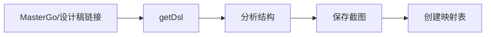

# Plan 创建提示词模板

> 用于指导 AI 创建符合 android.log.client 项目规范的开发 Plan。
> 适用范围：WinForms 窗体、TCP通信协议、ADB日志、自绘控件、测试项目、配置与验证任务。
> 完整技术栈见 [tech-stack.md](../../agents/tech-stack.md)。

---

## 快速提示词

### 场景 1：全新功能模块

```text
请为新功能「{{功能描述}}」创建开发 Plan：
- 功能类型：{{WinForms 页面 / TCP通信 / ADB日志 / 自绘控件 / 测试 / 配置 / 文档 / 其他}}
- 设计稿：{{MasterGo 链接 / 本地截图 / 现有页面 / 无设计稿}}
- 核心功能：{{列出主要功能点}}
- 需要的 API：{{API 列表，如适用}}
- 相关代码：{{文件路径，如适用}}

请按照 android.log.client 的 Plan 模板格式输出（见下方完整模板）。
```

### 场景 2：改造现有功能

```text
请为「{{现有功能}}」改造创建 Plan：
- 改造目标：{{改造说明}}
- 现有代码：{{文件路径}}
- 设计稿：{{MasterGo 链接 / 本地截图 / 无}}

请按照 android.log.client 的 Plan 模板格式输出。
```

### 场景 3：从设计稿开始

```text
请根据 MasterGo 设计稿创建开发 Plan：
- 设计稿链接：{{链接}}
- 功能说明：{{简要说明}}

步骤：
1. 使用 getDsl 获取设计稿结构
2. 分析组件层级和样式
3. 保存截图到 `ai/plans/screenshots/`
4. 创建完整 Plan
```

---

## 完整提示词模板

### 基础版（适用于大多数场景）

```markdown
# 任务：创建 android.log.client 功能开发 Plan

## 功能描述
{{详细描述本次功能的目标和范围}}

## 设计稿
- MasterGo 链接：{{链接}}
- 页面数量：{{数量}}
- 主要页面：{{列出页面名称}}
- 设计来源补充：{{WinForms 窗体 / Site 页面 / 现有截图 / 现有代码}}

## 技术要求
- [ ] 需要新增 API
- [ ] 需要新增数据模型
- [ ] 需要新增 WinForms 窗体
- [ ] 需要新增 Site 页面
- [ ] 需要新增站点路由 / 模块挂载
- [ ] 需要登录权限 / 认证
- [ ] 需要国际化 / 本地化
- [ ] 需要新增配置项
- [ ] 需要 DI 注册
- [ ] 需要测试 / smoke 验证
- [ ] 其他：{{说明}}

## 输出要求

请按照下方 android.log.client Plan 结构创建完整 Plan，至少包含：

1. **Summary**
   - 背景
   - 方案核心
   - 范围边界

2. **Key Changes**
   - 主要改动点
   - 新增模块 / 页面 / 接口
   - 与现有功能的关系或对比（如适用）

3. **Supplementary Requirements**
   - UI 设计
   - 数据模型设计
   - 路由 / 宿主配置
   - 配置设计
   - 本地化 / 多语言（如涉及）
   - 技能与文档同步要求

4. **File Tree**
   - 计划内涉及的文件与目录
   - 入口文件、模块文件、配置文件、页面文件、资源文件

5. **Phased Implementation**
   - Task 分解
   - 依赖关系
   - 验收检查点

6. **Test Plan**
   - 本地构建
   - 格式化检查
   - 页面 / 模块 smoke 测试
   - 路由 / 接口验证
   - 回归范围

7. **Assumptions**
   - 未确定事项
   - 默认方案
   - 风险与前提

## 特殊说明
{{其他需要注意的事项}}

## 计划命名规则

| 占位符 | 填写规则 | 示例 |
|--------|---------|------|
| `{{版本号}}` | `v1.0`、`v1.1`... | `v1.0` |
| `{{模块名}}` | 优先使用与仓库目录一致的 `PascalCase` | `M3U8StreamGetter` |
| `{{功能名}}` | `PascalCase` | `ProfileEdit` |
| `{{ModelName}}` | `PascalCase + Model/Dto/Options` | `UserProfileModel` |
| `{{FeatureName}}` | `PascalCase` | `TaskManager` |

## android.log.client 计划结构（输出模板）

> 如果当前任务是完整功能计划，建议按以下顺序输出：

1. `Summary`
2. `Key Changes`
3. `Supplementary Requirements`
4. `File Tree`
5. `Phased Implementation`
6. `Test Plan`
7. `Assumptions`

> 如果任务只涉及单点修补，可以简化 `File Tree` 和 `Phased Implementation`，但不能省略 `Summary`、`Key Changes`、`Test Plan`、`Assumptions`。
```

---

### UI 设计强化版（适用于复杂 UI）

```markdown
# 任务：创建包含完整 UI 设计的 android.log.client Plan

## 功能描述
{{描述}}

## 设计稿处理流程

请按以下步骤处理设计稿：

### Step 1: 获取设计稿结构
```
使用 mcp__getDsl 获取：
- shortLink: {{MasterGo 短链接}}
或
- fileId: {{fileId}}
- layerId: {{layerId}}
```

### Step 2: 分析并记录
请记录以下信息：

| 页面 | 组件层级 | 关键样式 | 备注 |
|------|---------|---------|------|
| 主页面 | {{层级}} | {{颜色/字体/间距}} | {{说明}} |
| 空状态 / 异常态 | {{层级}} | {{颜色/字体/间距}} | {{说明}} |

### Step 3: 保存截图
```
ai/plans/screenshots/{{模块名}}/
├── main_page.png
├── empty_state.png
└── ...
```

### Step 4: 设计转代码映射

| 设计元素 | android.log.client 实现 | Skill 参考 |
|---------|-------------------|-----------|
| 颜色 #0EA5E9 | `DashboardTheme` / `BackColor` / CSS 变量 | `winforms-theme-system` |
| 字体 14px Bold | `Font = new Font(...)` / CSS `font-weight: 700` | `dotnet-winforms-guidelines` |
| 间距 16px | `Padding` / `Margin` / `TableLayoutPanel` / CSS `gap` | `winforms-three-section-layout` |
| 列表 | 自绘控件列表 / 页面表格 | `custom-drawn-components` |
| 窗体外壳 | `Form + SplitContainer/TableLayoutPanel` | `dotnet-winforms-guidelines` |
| 自绘控件 | `UI/` / JsonTreeView | `dotnet-winforms-guidelines` |

## 输出要求
按照下方 android.log.client Plan 结构输出完整 Plan，特别关注「Supplementary Requirements」中的 UI 设计完整性。
```

---

## AI 执行指南（嵌入提示词）

当 AI 收到创建 Plan 的任务时，应遵循以下流程：

```markdown
## Plan 创建流程

### 1. 分析需求（5 分钟）
- [ ] 理解功能目标
- [ ] 确认设计稿来源
- [ ] 识别技术要点
- [ ] 确定需要的 Skills
- [ ] 判断任务属于 WinForms / Site / API / SDK / 配置 / 文档 / 验证中的哪一类

### 2. 获取设计信息（10 分钟）


**必做操作：**
```text
# 获取设计稿 DSL
mcp__getDsl(shortLink: "{{链接}}")

# 获取 D2C 代码（可选，适合页面或局部布局参考）
mcp__getD2c(
  contentId: "{{id}}",
  documentId: "{{id}}",
  outDir: "ai/plans/screenshots/{{模块名}}/d2c/"
)
```

### 3. 创建 Plan（15 分钟）

**章节优先级：**
1. ✅ Summary（必填）
2. ✅ Key Changes（必填）
3. ✅ Supplementary Requirements（UI / 数据模型 / 路由 / 配置 / 本地化）
4. ⭕ File Tree（如涉及多文件）
5. ⭕ 路由 / 宿主配置（如涉及）
6. ⭕ 国际化 / 本地化（如涉及）
7. ✅ Phased Implementation（必填）
8. ✅ Test Plan（必填）
9. ✅ Assumptions（必填）

**占位符填写规则：**
| 占位符 | 填写规则 | 示例 |
|--------|---------|------|
| `{{版本号}}` | `v1.0`、`v1.1`... | `v1.0` |
| `{{模块名}}` | 与仓库目录保持一致，优先 `PascalCase` | `M3U8StreamGetter` |
| `{{功能名}}` | `PascalCase` | `TaskManager` |
| `{{ModelName}}` | `PascalCase + Model/Dto/Options` | `TaskJobModel` |
| `{{FeatureName}}` | `PascalCase` | `ProfileEdit` |

### 4. 验证 Plan（5 分钟）
- [ ] 所有占位符已替换
- [ ] UI 截图已保存
- [ ] Task 依赖关系正确
- [ ] 验收检查点完整
- [ ] 相关 Skills 已列出
- [ ] 路由 / 配置 / 入口 / 依赖已写清楚

### 5. 输出确认
```
Plan 创建完成！
- 文件路径：ai/plans/xxx-v1.0.md
- 截图目录：ai/plans/screenshots/xxx/
- 下一步：等待用户确认后开始实施
```
```

### 技能加载建议

```markdown
## Skills 加载建议

| 场景 | 优先 Skills |
|------|-------------|
| 通用 C# / .NET | `rtk`、`dotnet-guidelines`、`donet-naming` |
| WinForms 外壳 / 设计器 / Dock 布局 | `dotnet-winforms-guidelines`、`winforms-three-section-layout` |
| 自定义控件 / 主题 / Designer-safe 替代控件 | `custom-drawn-components`、`winforms-theme-system` |
| Windows 原生能力 / 系统 API | `windows-function-sdk` |
| Dell iDRAC / 传感器 / 风扇控制 | `dell-server-sensor` |

## 前置阅读

- `README.md`
- `android.log.client.settings.json`
- `ai/agents/MEMORY.md`
- `Program.SiteHost.cs`
- `Ui/Main/MainForm.cs`
- 相关模块 README（如 `Sdk/NetworkSdk/README.md`、`Sdk/MySqlSdk/README.md`）
```

---

## android.log.client 计划模板建议结构

如果需要把 Plan 直接落成仓库文档，建议按这个结构写：

```markdown
# {{功能名}} 计划（v{{版本号}}）

## Summary

## Key Changes

## Supplementary Requirements

### UI 设计
### 数据模型设计
### 路由 / 宿主配置
### 配置设计
### 本地化 / 多语言

## File Tree

## Phased Implementation

## Test Plan

## Assumptions
```

---

## 示例：完整提示词

```markdown
# 任务：创建「M3U8StreamGetter 播放器与下载工作台」功能开发 Plan

## 功能描述
实现独立的 `M3U8StreamGetter` 站点，支持：
- `m3u8/mp4` 播放
- `inspect` 解析
- `ffmpeg` 合并 / 转封装 / 批量下载
- 任务进度、取消、产物下载
- `?url=` 深链启动
- SSRF 防护与磁盘空间防护

## 设计稿
- MasterGo 短链接：https://mastergo.com/goto/abc123
- 页面：主工作台、只解析预览页、深链落地页、任务面板

## 技术要求
- [x] 需要新增 API：`GET /m3u8-stream-getter/api/inspect`
- [x] 需要新增 API：`GET /m3u8-stream-getter/api/proxy`
- [x] 需要新增 API：`POST /m3u8-stream-getter/api/jobs`
- [x] 需要新增数据模型：`InspectResult`、`JobSubmitRequest`、`JobStatus`
- [x] 需要新增配置：`M3U8StreamGetter`
- [x] 需要站点宿主挂载
- [ ] 需要登录权限
- [ ] 需要国际化 / 多语言
- [ ] 其他：{{说明}}

## 请按以下步骤执行

### 1. 获取设计稿信息
使用 MasterGo MCP 获取设计稿结构，记录：
- 组件层级
- 关键样式（颜色、字体、间距）
- 交互状态

### 2. 保存截图
保存到 `ai/plans/screenshots/m3u8_stream_getter/`：
- `main_page.png`（主页面）
- `preview_page.png`（只解析页）
- `empty_state.png`（空状态）

### 3. 创建 Plan
按照 android.log.client Plan 模板输出完整 Plan，包括：
- Summary
- Key Changes
- Supplementary Requirements
- File Tree
- Phased Implementation
- Test Plan
- Assumptions

### 4. 加载 Skills
优先加载以下 Skills：
1. `rtk`
2. `dotnet-guidelines`
3. `donet-naming`
4. `dotnet-winforms-guidelines`
5. `winforms-three-section-layout`
6. `custom-drawn-components`
7. `winforms-theme-system`
8. `windows-function-sdk`
9. `iptv`
10. `dell-server-sensor`

## 特殊说明
- 复用现有 `NetworkSdk` / `MySqlSdk` 基础设施风格
- `Ui` 与 `Site` 的边界要写清楚
- 任何路由、配置、权限、队列、缓存、播放器和代理边界都要在 Plan 里明确
```

---

## 快捷命令

### 一键创建 Plan

```text
/create-plan {{功能名}} {{设计稿链接或代码路径}}
```

示例：

```text
/create-plan M3U8StreamGetter https://mastergo.com/goto/abc123
```

### 快速截图保存

```text
/save-screenshot {{模块名}} {{状态}}
```

示例：

```text
/save-screenshot M3U8StreamGetter main_page
```

---

## 注意事项

1. **设计稿优先**：有设计稿时，先获取 DSL 再创建 Plan。
2. **截图必存**：所有设计稿相关页面必须保存截图，WinForms / Site 页面都算。
3. **映射完整**：UI 设计章节的设计规范映射表必须填写完整。
4. **Task 细化**：每个 Task 必须有明确的验收检查点。
5. **Skills 明确**：列出实施所需的 Skills 及加载时机。
6. **项目边界清晰**：涉及 `Sdk/`、`Components/`、`Ui/`、`android.log.client.settings.json` 或任意模块 README 时，Plan 必须同步写清楚。

---

## 模板使用指南

| 场景 | 推荐模板 | 说明 |
|------|---------|------|
| 简单功能 | 快速提示词 + 场景 1 | 3-5 句描述即可 |
| 复杂 UI | UI 设计强化版 | 强调设计稿处理 |
| 改造功能 | 快速提示词 + 场景 2 | 说明现有代码 |
| 完整功能 | 完整提示词模板 | 详细需求 + 设计稿 |
| WinForms 外壳 / Designer | UI 设计强化版 | 重点检查 `Form` / `SplitContainer` / `JsonTreeView` / 自绘控件 |
| 站点模块 / 路由 / API | 完整提示词模板 | 重点检查宿主、路由、配置、权限、静态资源 |

---

## 输出文件位置

```text
ai/plans/
├── {{模块名}}-v{{版本号}}.md     # Plan 文件
└── screenshots/
    └── {{模块名}}/               # 设计截图
        ├── main_page.png
        ├── preview_page.png
        └── ...
```

---

**创建时间**：2026-05-12
**适用版本**：android.log.client 计划模板 v1.0+
