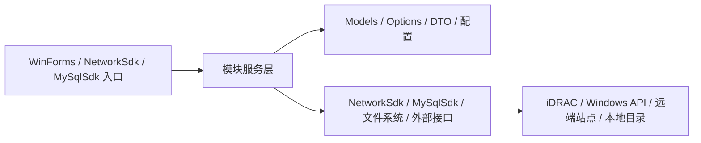
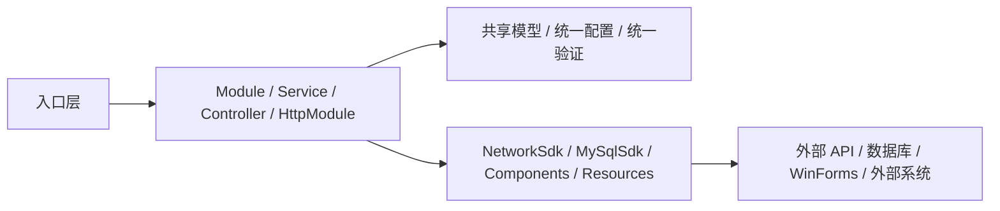
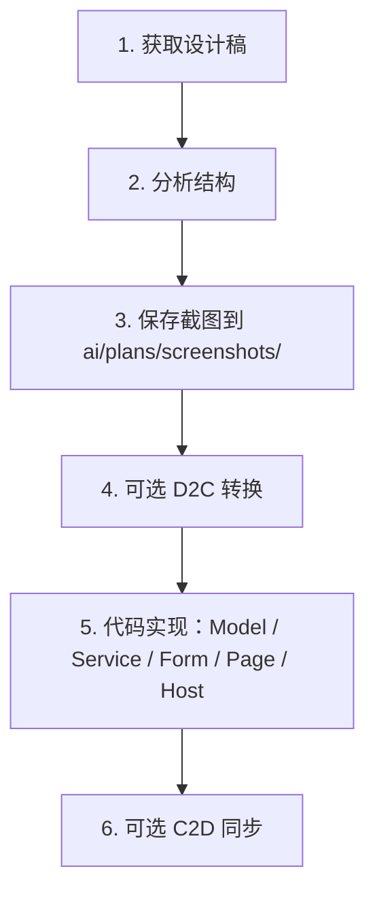
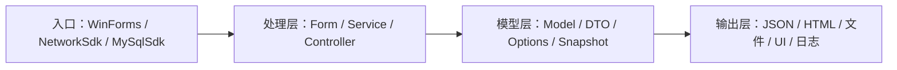
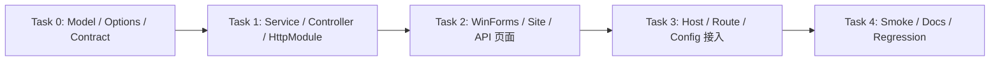

# plan-{{模块名}}-v{{版本}}

> **For agentic workers:** 实施本 Plan 前先加载 `rtk` 和本任务所需的 android.log.client skills；按 Task 顺序执行，每完成一个 Task 运行 `rtk dotnet build` 验证，涉及格式、命名或 using 变化时再补 `rtk dotnet format --verify-no-changes`。若涉及 WinForms UI，优先加载 `dotnet-winforms-guidelines`，并按需加入 `winforms-three-section-layout`、`custom-drawn-components`、`winforms-theme-system`、`winforms-mainform-scaffold`。

**Goal:** {{一句话描述本次 Plan 的核心目标}}

**Architecture:** {{2-3 句描述技术方案核心设计}}

**定位：** {{新增功能 / 改造现有功能 / 优化重构}}，{{对其他模块的影响说明}}

---

## 占位符说明

| 占位符 | 含义 | 示例 |
|--------|------|------|
| `{{版本号}}` | Plan 版本 | `v1.0` |
| `{{模块名}}` | 模块目录名（优先沿用仓库现有 PascalCase 命名） | `Iptv` / `FileOnlinePlayer` / `M3U8StreamGetter` |
| `{{模型名}}` | 数据模型文件名前缀 | `song` → `SongModels.cs` / `song_dto` → `SongDto.cs` |
| `{{功能名}}` | 功能、服务、窗体或宿主前缀 | `kugou_music` → `KuGouMusicController.cs` |
| `{{ModelName}}` | 数据模型类名（PascalCase） | `SongDto` / `IptvCatalogSnapshot` |
| `{{FeatureName}}` | 功能类名（PascalCase） | `KuGouMusicController` / `IptvMaintenanceForm` |
| `{{featureName}}` | 功能变量名（camelCase） | `kuGouMusicController` / `iptvMaintenanceForm` |

---

## 技术栈

> 完整技术栈、外部依赖、自研基础设施、测试配置详见 [tech-stack.md](../../agents/tech-stack.md)。以下仅列出与 Plan 实施直接相关的选型摘要：

| 类别 | 技术选型 | 说明 |
|------|---------|------|
| **Windows UI** | WinForms + 自绘控件 | Form 窗体基类、JsonTreeView 自绘树、VirtualMode ListView |
| **网络请求** | `NetworkSdk` + `HttpClient` | 请求发送、下载、拦截器管线、重试策略、结构化日志与脱敏 |
| **本地存储** | `MySqlSdk` + `MySqlConnector` / 文件系统 | MySQL 异步客户端、事务、批量写入、UI 线程调度 |
| **验证** | `rtk dotnet build` / `rtk dotnet test` / `rtk dotnet format --verify-no-changes` | 每个 Task 结束后执行 |

---

## 相关 Skills

| Skill | 用途 | 加载时机 |
|-------|------|---------|
| `rtk` | android.log.client 所有 shell 命令的公共前缀 | 开始实施前（必需，`.opencode/skills/rtk/`） |
| `dotnet-guidelines` | C# / .NET 编码规范、异步、异常、日志、DI | 开始实施前（核心） |
| `donet-naming` | 文件、命名空间、类型、成员、测试命名 | 涉及命名 / 新文件时 |
| `dotnet-winforms-guidelines` | WinForms 窗体显示、生命周期、关闭、Owner、加载 | 涉及 WinForms 时 |
| `custom-drawn-components` | 自绘控件、Designer-safe 包装、交互与稳定性 | 涉及 `Components/Composite/` 自定义控件时 |

### Skills 加载决策树

```
┌───────────────────────────────────────────────┐
│  开始：分析需求场景                            │
└───────────────┬───────────────────────────────┘
                │
                ▼
┌───────────────────────────────────────────────┐
│  是否首次接入 / 不确定 android.log.client 规范？   │
│  YES → `rtk` + `dotnet-guidelines`            │
└───────────────┬───────────────────────────────┘
                │ NO
                ▼
┌───────────────────────────────────────────────┐
│  是否涉及命名、文件名、模型名、Options、DTO？  │
│  YES → 加载 `donet-naming`                    │
└───────────────┬───────────────────────────────┘
                │ NO
                ▼
┌───────────────────────────────────────────────┐
│  是否涉及 WinForms / 窗体 / 交互 / Designer？  │
│  YES → 加载 `dotnet-winforms-guidelines`       │
│        → 再判断布局/主题/自绘/主窗体            │
└───────────────┬───────────────────────────────┘
                │ NO
                ▼
┌───────────────────────────────────────────────┐
│  是否涉及 native Windows / Dell / IPTV？       │
│  YES → 加载对应领域 skill                      │
└───────────────┬───────────────────────────────┘
                │
                ▼
┌───────────────────────────────────────────────┐
│  统计已加载 Skills 数量                        │
│  > 5 个 → 保留 P0/P1，舍弃 P2/P3               │
└───────────────────────────────────────────────┘
```

**推荐组合：**

| 场景 | 建议 Skills |
|------|------------|
| 新建 android.log.client 模块 | `rtk` + `dotnet-guidelines` + `donet-naming` |
| 新建 WinForms 页面 | `rtk` + `dotnet-guidelines` + `donet-naming` + `dotnet-winforms-guidelines` + `winforms-three-section-layout` |
| 新建自绘控件或主题 | `rtk` + `dotnet-guidelines` + `custom-drawn-components` |
| 新增 API / Host / 站点模块 | `rtk` + `dotnet-guidelines` + `donet-naming` |

---

## 一、功能介绍

### 1.1 背景

{{说明为什么要做这个功能，现有什么问题，解决什么痛点。结合当前模块、宿主或配置情况写清楚。}}

### 1.2 现有架构（如适用）



### 1.3 新增后架构（如适用）



### 1.4 方案核心

{{用一段话概括方案的核心设计思路，重点说明模块边界、宿主边界、配置边界和验证边界。}}

### 1.5 功能对比（如适用）

| 维度 | 现在 | 新增后 |
|------|------|--------|
| 入口方式 | {{现状}} | {{改进}} |
| 模型 / 配置 | {{现状}} | {{改进}} |
| 宿主 / 路由 | {{现状}} | {{改进}} |
| UI / 页面 | {{现状}} | {{改进}} |
| 验证方式 | {{现状}} | {{改进}} |

### 1.6 配置与运行时（如适用）

- `Enabled`、`Port`、`Prefixes`、`BasePath`、`DashboardDirectory`、`SharedStaticDirectory` 这类字段通常属于宿主启动快照，改动后往往需要重启宿主。
- `FileOnlinePlayer.SourceDirectory`、`AndroidAppVersionName`、`AndroidAppVersionCode`、`AndroidAppUpdateTime`、`AndroidAppPackagePath` 这类字段如果对应模块支持运行时刷新，可在进程内生效，但应在 Plan 中明确说明。
- `Iptv.WorkspaceDirectory`、`ProbeTimeoutMs`、`Parallelism`、`RetryCount`、`UseServerProxyForPlayback` 等字段要明确是否支持热更新。
- 若 Plan 改动配置语义，必须同步更新 `android.log.client.settings.json`、对应 `*Options.cs`、`*RuntimeSettingsLoader.cs`、模块 README 和必要的注释。

---

## 二、UI 设计

### 2.1 设计稿来源

| 项目 | 说明 |
|------|------|
| **设计平台** | MasterGo / 现有 WinForms 截图 / 现有 Site 页面 / 无设计稿 |
| **设计稿链接** | `{{MasterGo 文件链接}}` |
| **设计规范** | `{{设计规范链接，如适用}}` |
| **补充来源** | `{{现有页面、README、历史截图、用户草图等}}` |

### 2.2 页面截图

**截图存放位置：** `ai/plans/screenshots/{{模块名}}/`

```
ai/plans/screenshots/{{模块名}}/
├── main_form.png          # 主窗体 / 主页面
├── detail_view.png        # 详情页 / 子页
├── loading_state.png      # 加载态
├── empty_state.png        # 空态
├── error_state.png        # 错误态
├── preview_state.png      # 预览 / 只读态
└── theme_state.png        # 主题 / 深浅色 / 皮肤状态（如适用）
```

**截图要求：**
- 使用设计稿导出、真机截图或本地运行截图
- 图片格式：PNG，分辨率不低于 2x
- 文件命名：snake_case，简洁明了

### 2.3 MasterGo MCP 工作流

#### 获取设计稿 DSL

```bash
# 方式 1：通过短链接
mcp__getDsl(shortLink: "https://mastergo.com/goto/xxxxx")

# 方式 2：通过 fileId + layerId
mcp__getDsl(
  fileId: "file/12345",
  layerId: "layer_id_value"
)
```

**输出内容：**
- 组件层级结构
- 样式属性（颜色、字体、间距、圆角、阴影等）
- 布局信息
- 代码生成规则

#### D2C（设计转代码）

```bash
# 获取 D2C 数据并保存到本地
mcp__getD2c(
  contentId: "176452330285910-2-2845",
  documentId: "176452330285910",
  outDir: "C:\\_worklog\\{{yyyy_MM}}\\{{DD}}\\d2c_output"
)
```

**输出文件：**
- `{{component}}.html` - HTML 代码
- `*.svg` - SVG 图标资源
- `images/` - 图片资源

#### C2D（代码转设计）

```bash
# 将代码同步回设计稿
mcp__C2d(
  filePath: "{{HTML 或 CSS 文件路径}}",
  fileId: "12345",
  layerId: "layer_id"  # 可选
)
```

### 2.4 设计转代码流程



### 2.5 设计规范映射

| 设计属性 | android.log.client 实现 | 说明 |
|---------|-------------------|------|
| 颜色 | `SystemColors` 或项目语义常量 | WinForms 默认系统颜色 |
| 字体 | `Font` / CSS `font-family`、`font-size`、`font-weight` | WinForms 与站点各自实现 |
| 间距 | `Padding` / `Margin` / `Dock` / `Anchor` / `TableLayoutPanel` / CSS `gap` | 统一布局骨架 |
| 圆角 | 自绘路径 / CSS `border-radius` | WinForms 和 Site 分别处理 |
| 图片 | `Image` / `PictureBox` / `ImageList` / SVG / `Resources/static` / `Site/<模块>/` | 图片 |
| 组件 | `Components/Composite/` 自绘控件 / `Components/Atomic/Theming/` / HTML + CSS + JS | 优先复用项目控件 |

**WinForms 额外约束：**

- 窗体外壳统一使用 `Form` 窗体基类 + `SplitContainer` / `TableLayoutPanel` 根布局。
- 根布局和中间内容区必须使用 `TableLayoutPanel`，不要用 `Panel` 替代。
- 列表型 WinForms 视图优先使用自绘控件实现，参考 `Components/Composite/` 下现有控件模式。

---

## 三、数据模型设计

### 3.1 目录结构

> 完整项目目录树详见 [directory-tree.md](../../agents/directory-tree.md)。
```

### 3.2 数据流向



### 3.3 模型与配置约定

- DTO、Request、Response、Event 一律使用 PascalCase，并按 `donet-naming` 规则命名。
- JSON 序列化优先使用 `System.Text.Json`，属性名偏差时使用 `[JsonPropertyName]`。
- 配置类统一以 `Options` 结尾，运行时加载器统一以 `RuntimeSettingsLoader` 或项目内约定命名。
- 需要跨模块共享的契约优先放到对应模块的 `Models` / `Contracts` / `Options`，不要散落在页面代码或宿主入口。
- 若使用 `NetworkSdk`，返回值优先封装为 `NetworkResponse<T>` 或项目现有响应模型。
- 若使用 `MySqlSdk`，模型需明确连接配置、事务边界与批量写入策略。

---

## 四、SDK 与配置（如涉及）

### 4.1 NetworkSdk 使用规则

- 使用 `INetworkClient` 发送请求，通过 `NetworkClientBuilder` 配置拦截器、重试、超时。
- DI 注册通过 `AddNetworkClient()` 扩展方法。
- 请求选项通过 `NetworkClientOptions` 配置。
- 详见 [NetworkSdk/README.md](../../Sdk/NetworkSdk/README.md)。

### 4.2 MySqlSdk 使用规则

- 使用 `IMySqlClient` 执行异步查询和命令，支持事务和批量写入。
- DI 注册通过 `AddMySqlSdk()` 扩展方法。
- 连接选项通过 `MySqlSdkOptions` 配置。
- 详见 [MySqlSdk/README.md](../../Sdk/MySqlSdk/README.md)。

### 4.3 配置文件与入口

- 涉及程序入口时，优先检查 `Program.cs`。
- 涉及配置时，优先检查 `android.log.client.settings.json`、对应 `*Options.cs`。
- 涉及 WinForms 宿主时，优先检查 `Form1.cs` 与相关 partial 文件。

---

## 五、实施阶段

### 依赖关系



**推荐顺序：** Model / Options → Service / Controller → UI / Site / API → Host / Route → 验证 / 文档

---

### Task {{编号}}：{{任务名称}}

**Files:**
- Create/Modify: `{{文件路径}}`

**✅ 验收检查点：**

| # | 检查项 | 验证方式 |
|---|--------|---------|
| 1 | {{检查项}} | {{验证方式}} |

- [ ] **Step 1: {{操作描述}}**

```csharp
// 代码示例（如适用）
```

- [ ] **Step 2: 运行构建验证（如涉及代码改动）**

```bash
rtk dotnet build .\android.log.client.sln
```

Expected: Build succeeds

- [ ] **Step 3: 运行格式验证（如涉及 using / 命名 / 结构调整）**

```bash
rtk dotnet format --verify-no-changes .\android.log.client.sln
```

Expected: No formatting drift

- [ ] **Step 4: 手动 smoke（如涉及宿主 / UI / API）**

```bash
rtk powershell -NoProfile -Command "Start-Process dotnet -ArgumentList 'run --project .\\android.log.client\\android.log.client.csproj' -WindowStyle Hidden"
```

Expected: 页面 / API / 宿主可访问，核心流程可走通

---

### Task 参考示例（按需复制）

以下为常见 Task 类型的参考示例，实际使用时根据需要复制并填充具体内容。

---

### 示例 A：创建数据模型 / DTO / Options

**Files:**
- Create: `android.log.client/{{模块名}}/Models/{{模型名}}.cs`

- [ ] **Step 1: 创建数据模型**

```csharp
using System.Text.Json.Serialization;

namespace android.log.client.Api.KuGouMusic.Models.Search;

public sealed record SearchRequest(
    [property: JsonPropertyName("keywords")] string Keywords,
    [property: JsonPropertyName("page")] int Page = 1,
    [property: JsonPropertyName("pagesize")] int PageSize = 20);
```

- [ ] **Step 2: 运行构建验证**

```bash
rtk dotnet build .\android.log.client.sln
```

- [ ] **Step 3: 验证命名与格式**

```bash
rtk dotnet format --verify-no-changes .\android.log.client.sln
```

---

### 示例 B：创建业务 Service / Provider / Client

**Files:**
- Create: `android.log.client/{{模块名}}/Services/{{功能名}}Service.cs`

- [ ] **Step 1: 创建 Service**

```csharp
namespace android.log.client.Api.KuGouMusic.Services;

public sealed class KuGouSearchService(
    ILogger<KuGouSearchService> logger,
    NetworkClient client)
{
    private readonly ILogger<KuGouSearchService> _logger = logger;
    private readonly NetworkClient _client = client;

    public async Task<IReadOnlyList<string>> SearchAsync(string keywords, CancellationToken cancellationToken = default)
    {
        // TODO: 调用 NetworkSdk / 外部接口
        return [];
    }
}
```

- [ ] **Step 2: 运行构建验证**

```bash
rtk dotnet build .\android.log.client.sln
```

---

### 示例 C：创建 WinForms 页面 / 窗体

**Files:**
- Create/Modify: `android.log.client/Ui/{{模块名}}/{{FeatureName}}Form.cs`
- Create/Modify: `android.log.client/Ui/{{模块名}}/{{FeatureName}}Form.Designer.cs`
- Create/Modify: `android.log.client/Ui/{{模块名}}/{{FeatureName}}Form.resx`

- [ ] **Step 1: 创建 WinForms 页面**

```csharp
using android.log.client.Components.Atomic.Theming;

namespace android.log.client.Ui.Iptv;

public sealed partial class LogDetailForm : Form
{
    public IptvMaintenanceForm()
    {
        InitializeComponent();
        Load += OnLoad;
        Shown += OnShown;
    }

    private async void OnShown(object? sender, EventArgs e)
    {
        await RefreshAsync();
    }
}
```

- [ ] **Step 2: 确认三段式布局与控件复用**

```csharp
mainPanel.Dock = DockStyle.Fill;
buttonPanel.Dock = DockStyle.Bottom;
```

- [ ] **Step 3: 运行构建验证**

```bash
rtk dotnet build .\android.log.client.sln
```

---

### 示例 D：共享静态资源 / 图片 / 图标 / 模块页面

**说明：** WinForms 侧优先使用资源、`Image`、`PictureBox`、`ImageList`；站点侧优先使用 `Resources/static` 或 `Site/<模块名>` 下的静态资源。

**Files:**
- Create/Modify: `android.log.client/Resources/static/...`
- Create/Modify: `android.log.client/Site/{{模块名}}/...`

- [ ] **Step 1: 准备静态资源**

```csharp
// 示例：WinForms 直接引用资源或模块自带图片
pictureBox.Image = Properties.Resources.AppIcon;
```

- [ ] **Step 2: 页面中引用共享壳资源**

```html
<link rel="stylesheet" href="/static/css/base.css">
<script src="/static/js/page-shell.js"></script>
```

- [ ] **Step 3: 运行构建 / smoke 验证**

```bash
rtk dotnet build .\android.log.client.sln
```

---

### 示例 E：API 定义（NetworkSdk 请求）

**Files:**
- Create/Modify: `android.log.client/Sdk/NetworkSdk/Abstractions/INetworkClient.cs`
- Create/Modify: `android.log.client/{{模块名}}/Models/{{模型名}}.cs`

- [ ] **Step 1: 创建请求服务**

```csharp
using android.log.client.Sdk.NetworkSdk.Abstractions;

namespace android.log.client.Api.KuGouMusic.Services;

public sealed class KuGouMusicService(
    ILogger<KuGouMusicService> logger,
    INetworkClient client)
{
    public async Task<SearchResponse?> SearchAsync(string keywords, CancellationToken ct = default)
    {
        return await client.GetAsync<SearchResponse>("/search", new { keywords }, ct);
    }
}
```

- [ ] **Step 2: 运行构建验证**

```bash
rtk dotnet build .\android.log.client.sln
```

---

### 示例 F：SDK 配置 / DI 注册

**Files:**
- Modify: `android.log.client/Sdk/{{Sdk名}}/Options/{{Sdk名}}Options.cs`
- Modify: `android.log.client/Sdk/{{Sdk名}}/Extensions/{{Sdk名}}ServiceCollectionExtensions.cs`
- Modify: `android.log.client.settings.json`
- Modify: `android.log.client/Program.cs`

- [ ] **Step 1: 添加 SDK 选项**

```csharp
public sealed class CustomSdkOptions
{
    public bool Enabled { get; set; } = true;
    public string Endpoint { get; set; } = string.Empty;
    public int TimeoutMs { get; set; } = 30000;
}
```

- [ ] **Step 2: 注册 DI 扩展**

```csharp
public static class CustomSdkServiceCollectionExtensions
{
    public static IServiceCollection AddCustomSdk(
        this IServiceCollection services,
        Action<CustomSdkOptions> configure)
    {
        services.Configure(configure);
        services.AddSingleton<ICustomClient, CustomClient>();
        return services;
    }
}
```

- [ ] **Step 3: 验证构建与 DI 注册**

```bash
rtk dotnet build .\android.log.client.sln
```

---

### 示例 G：自绘控件列表 / 表格维护页

**Files:**
- Create/Modify: `android.log.client/Ui/{{模块名}}/...`
- Create/Modify: `android.log.client/Components/Composite/`（仅在确需扩展共用控件时）

- [ ] **Step 1: 创建列表页**

```csharp
private void InitializeComponent()
{
    // 使用 TableLayoutPanel + 自绘控件构建列表
    // 参考 Components/Composite/ 下的自绘控件模式
}
```

- [ ] **Step 2: 绑定数据**

```csharp
await LoadDataAsync(cancellationToken);
```

- [ ] **Step 3: 确认 Designer-safe 约束**

```text
自绘控件必须：
- 订阅 ThemeChanged + OnPaint 读 CurrentPalette + Dispose 取消订阅
- 使用 SystemColors 或项目语义常量，禁止硬编码
- 设计时跳过运行时逻辑（IsDesignTimeFor）
```

- [ ] **Step 4: 运行构建验证**

```bash
rtk dotnet build .\android.log.client.sln
```

---

## 六、测试计划

- 本地构建：`rtk dotnet build .\android.log.client.sln`
- 格式检查：`rtk dotnet format --verify-no-changes .\android.log.client.sln`
- 单元测试：`rtk dotnet test .\android.log.client.Tests\android.log.client.Tests.csproj`
- WinForms smoke：启动程序，检查窗体打开、关闭、加载态、空态、错误态与主题是否正常
- SDK smoke：调用 NetworkSdk / MySqlSdk 接口，检查请求、响应、重试、超时与日志是否正常
- 配置 smoke：修改 `android.log.client.settings.json` 后确认哪些字段热生效、哪些字段需重启
- 回归范围：明确本次改动影响的模块、共享控件、入口与配置项

---

## 七、附录

### A. 文件清单

| 文件路径 | 操作 | 行数估计 | 说明 |
|----------|------|---------|------|
| `ai/plans/screenshots/{{模块名}}/` | 新增 | - | 设计截图目录 |
| `android.log.client/{{模块名}}/Models/{{模型名}}.cs` | 新增 / 修改 | ~20-80 | DTO / Options / Snapshot |
| `android.log.client/{{模块名}}/Services/{{功能名}}Service.cs` | 新增 / 修改 | ~40-120 | 业务服务 |
| `android.log.client/Sdk/{{Sdk名}}/Abstractions/I{{Sdk名}}Client.cs` | 新增 / 修改 | ~40-120 | SDK 客户端接口 |
| `android.log.client/Site/{{模块名}}/index.html` | 新增 / 修改 | ~40-200 | 站点页面 |
| `android.log.client/Site/{{模块名}}/script.js` | 新增 / 修改 | ~40-250 | 页面脚本 |
| `android.log.client/Ui/{{模块名}}/{{FeatureName}}Form.cs` | 新增 / 修改 | ~80-250 | WinForms 页面 |
| `android.log.client/Program.cs` | 修改 | ~10-50 | 入口声明与 Main |
| `android.log.client/Sdk/{{Sdk名}}/Options/{{Sdk名}}Options.cs` | 新增 / 修改 | ~20-60 | SDK 选项 |
| `android.log.client/Sdk/{{Sdk名}}/Extensions/{{Sdk名}}ServiceCollectionExtensions.cs` | 新增 / 修改 | ~20-60 | SDK DI 注册 |
| `android.log.client/Components/Composite/*` | 新增 / 修改 | ~100-500 | 自绘控件 |
| `android.log.client/Tests/{{Sdk名}}/*.Tests.cs` | 新增 / 修改 | ~50-200 | 单元测试 |
| `android.log.client.settings.json` | 修改 | - | 运行时配置 |

**预计总改动：** 新增 ~XXX 行，修改 ~YYY 行，删除 ~ZZZ 行

**临时文件：** 临时文件存放于仓库外的工作目录（如 `C:\_worklog\` 或现有临时目录），按 `yyyy_MM/DD` 格式组织，不提交 git。

### B. 已确认的决策记录

| # | 决策 | 结论 | 日期 |
|---|------|------|------|
| {{编号}} | {{决策}} | {{结论}} | {{日期}} |

---

## 当前阶段跟踪

| 阶段 | 状态 | 开始时间 | 完成时间 | 备注 |
|------|------|---------|---------|------|
| 阶段 0 | {{未开始 / 进行中 / 已完成}} | {{YYYY-MM-DD}} | {{YYYY-MM-DD}} | {{备注}} |
| 阶段 1 | {{未开始 / 进行中 / 已完成}} | {{YYYY-MM-DD}} | {{YYYY-MM-DD}} | {{备注}} |

**阶段状态说明：**

| 状态 | 含义 |
|------|------|
| 未开始 | 尚未启动 |
| 进行中 | 正在实施 |
| 已完成 | 验收通过 |

**Task 完成清单：**

- [ ] Task 0: {{任务名称}}
- [ ] Task 1: {{任务名称}}
- [ ] Task 2: {{任务名称}}

**当前进行阶段：** 阶段 {{编号}} - {{阶段名称}}

---

**创建时间**：{{YYYY-MM-DD HH:mm:ss}}
**状态**：{{规划中 / 实施中 / 已完成 / review 中 / review 打回 / 已废弃}}
**关联 Review**：{{reviews/review-vX.X.X.md（全部实施完成后填写）}}
